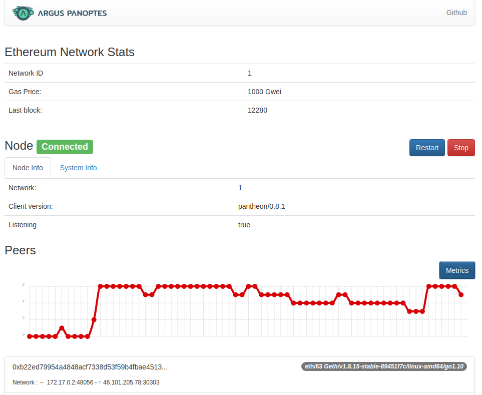

# Argus Panoptes

Argus Panoptes launches, monitors, and analyzes 'Pantheon' nodes. Pantheon, now called 'Hyperledger Besu', is an Ethereum client focused on permissioned networks while maintaining compatibility with the Ethereum public network.

This project won second place at the 2018 Pegasys hackathon. Its features have been integrated into Hyperledger Besu (https://besu.hyperledger.org/public-networks/how-to/monitor/metrics).

## What it does?
- Pulls and launches Pantheon from the latest docker image
- Queries information using stdout and the JSON RPC of the node
- Displays analytics such as the number and list of connected peers
- Offers graphical commands to start, stop, and reboot the node
- Can be used locally or on a server



## Prerequisites

- Docker > 17.03
- Nodejs > 8.0
- Git

## Linux and MacOS X installation
```bash
git clone git@github.com:Xalava/apanoptes.git
npm install 
sudo node server/logsMonitor.js
npm run dev
```
  
To avoid using sudo, you can also use `sudo chmod 077 /var/run/docker.sock`. Please contribute to [improve this](https://github.com/Xalava/apanoptes/issues/1).

## Clean docker 
To clean up Docker resources, including dangling images and build cache, you can run the following command:
```bash
sudo docker system prune --volumes
```

## Name
Argus "Panoptes" ("that sees it all") is a giant in Greek mythology. With his 100 eyes, he was tasked by Hera with keeping the nymph Io safe from Zeus' interest. Needless to say, it didn't end well for him. However, Hera transferred his eyes to the peacock's tail. 


*The Myth of Io - Bartolomeo di Giovanni*

*Available at The Walters Art Museum*